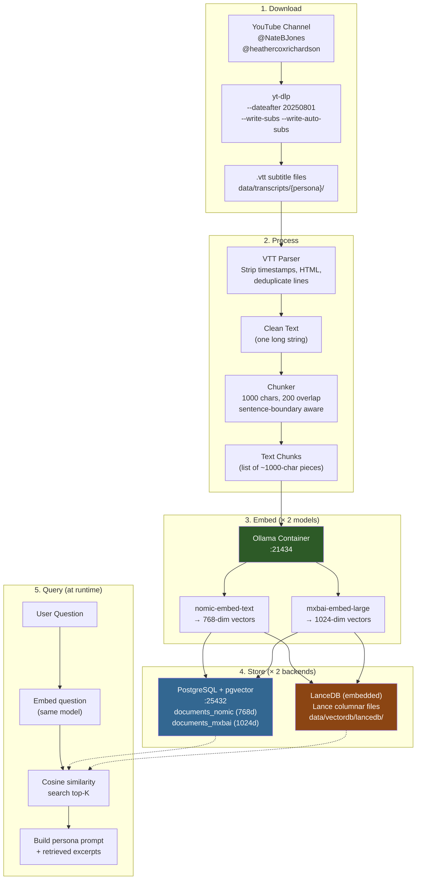

# Longspear 🗡️

**A fully local, Docker-based RAG system for AI-moderated debates.**

Impersonate **Heather Cox Richardson** (political historian) and **Nate B Jones** (AI strategist) using their actual YouTube transcripts as grounding knowledge — all running locally, no cloud dependencies.

## How to Use

```bash
# 1. Start everything
./scripts/setup.sh up

# 2a. Ingest transcripts — test mode (5 most recent videos per channel)
./scripts/setup.sh ingest-test

# 2b. Ingest transcripts — full (all videos since Aug 2025 cutoff)
./scripts/setup.sh ingest

# 3. Query via API
curl -X POST http://localhost:28000/query \
  -H "Content-Type: application/json" \
  -d '{"question": "What is happening with AI?", "persona": "nate_b_jones"}'
```

## Flow diagram




## What Was Built

A fully local, Docker-based **Retrieval-Augmented Generation (RAG)** system for AI-moderated debates, impersonating Heather Cox Richardson and Nate B Jones using their YouTube transcripts as grounding knowledge.

## Files Created (43 total)

### Infrastructure
| File | Purpose |
|------|---------|
| [docker-compose.yml](file:///Users/bedwards/vibe/longspear/docker-compose.yml) | PostgreSQL+pgvector + Python app |
| [Dockerfile](file:///Users/bedwards/vibe/longspear/Dockerfile) | Python 3.12-slim-bookworm app image |
| [scripts/init_db.sql](file:///Users/bedwards/vibe/longspear/scripts/init_db.sql) | pgvector extension + dual-dimension tables + HNSW indexes |
| [scripts/setup.sh](file:///Users/bedwards/vibe/longspear/scripts/setup.sh) | Convenience wrapper for all Docker operations |

### Configuration
| File | Purpose |
|------|---------|
| [config/settings.yaml](file:///Users/bedwards/vibe/longspear/config/settings.yaml) | Central config: cutoff date, channels, models, stores, chunking |
| [config/personas/heather_cox_richardson.yaml](file:///Users/bedwards/vibe/longspear/config/personas/heather_cox_richardson.yaml) | HCR persona: system prompt, speaking style, bio |
| [config/personas/nate_b_jones.yaml](file:///Users/bedwards/vibe/longspear/config/personas/nate_b_jones.yaml) | NBJ persona: system prompt, speaking style, bio |

### Source Code (Python)
| Module | Key Files | Design Pattern |
|--------|-----------|----------------|
| `src/config.py` | Pydantic settings loader | Singleton (cached) |
| `src/embeddings/` | `base.py`, `ollama_base.py`, `nomic.py`, `mxbai.py` | Strategy + Factory + DRY base |
| `src/vectorstores/` | `base.py`, `pgvector_store.py`, `lancedb_store.py` | Strategy + Factory |
| `src/ingest/` | `downloader.py`, `processor.py`, `pipeline.py` | Pipeline orchestrator |
| `src/retrieval/` | `retriever.py`, `context_builder.py` | Query + prompt builder |
| `src/api/` | `server.py` | FastAPI REST endpoints |

### Tests
- `test_config.py` — Settings loading, persona loading, embedding dimensions
- `test_embeddings.py` — Factory, provider instantiation
- `test_vectorstores.py` — Factory, dataclasses, LanceDB lifecycle
- `test_ingest.py` — VTT parsing, deduplication, chunking

## Key Architecture Decisions

1. **LanceDB is embedded**, not a server — runs inside the Python app container, no MinIO needed
2. **Separate pgvector tables** per embedding model (768 vs 1024 dimensions), each with HNSW cosine index
3. **DRY `OllamaEmbeddingBase`** — both embedding providers inherit and only override `model_name` + `dimensions`
4. **Claude Opus 4 training cutoff: August 2025** — transcripts after this date are novel to the model
5. **Python 3.12 on Debian bookworm** (not Alpine) for LanceDB binary compatibility
6. **Non-standard ports** (21434, 25432, 28000) to avoid conflicts with native Ollama/Postgres

## Docker Status (Verified ✅)

- ✅ Native Ollama with Metal GPU on port 11434 (nomic-embed-text + mxbai-embed-large pulled)
- ✅ PostgreSQL + pgvector healthy on port 25432 (Docker)
- ✅ FastAPI app serving on port 28000 (Docker)
- ✅ Health endpoint returns all services healthy
- ✅ 274 HCR transcripts downloaded (8,179 chunks)
- ⏳ Full ingest pipeline — ready to run

## Architecture

```
                  ┌─────────────────────────────────┐
                  │  Native Ollama (Metal GPU)   │
                  │  nomic-embed-text            │
                  │  mxbai-embed-large           │
                  │  :11434                      │
                  └───────────────┬─────────────────┘
                                │
            host.docker.internal:11434
                                │
┌───────────────────────────────────────────────────┐
│              Docker Compose                      │
│                                                   │
│  ┌──────────────────┐  ┌───────────────────────┐  │
│  │   PostgreSQL     │  │       Python App        │  │
│  │   + pgvector     │  │                         │  │
│  │                  │  │  FastAPI  │  LanceDB    │  │
│  │  Vector Store A  │  │  :28000  │  (embedded) │  │
│  │  :25432          │  │          │  Store B    │  │
│  └──────────────────┘  └───────────────────────┘  │
└───────────────────────────────────────────────────┘
                                        ▲
                                        │
                                  Agent Query
                                 (Claude Code,
                                  Gemini CLI)
```

### Dual Everything — Compare Side by Side

| Layer | Option A | Option B |
|-------|----------|----------|
| **Vector Store** | PostgreSQL + pgvector (v0.8.2) | LanceDB (embedded) |
| **Embedding** | nomic-embed-text (768 dims) | mxbai-embed-large (1024 dims) |
| **Data Source** | Heather Cox Richardson (political history) | Nate B Jones (AI strategy) |

## Quick Start

### Prerequisites

- [Docker](https://docs.docker.com/get-docker/) and Docker Compose
- [Ollama](https://ollama.com) installed natively (for Metal GPU)
- ~1GB disk for PostgreSQL data

### 1. Setup

```bash
# Clone and configure
cd longspear
./scripts/setup.sh setup

# Review and edit .env if needed
cat .env
```

### 2. Start Services

```bash
# Ensure native Ollama is running with models
ollama pull nomic-embed-text
ollama pull mxbai-embed-large

./scripts/setup.sh up
```

### 3. Ingest Transcripts

```bash
# Test mode (5 most recent videos per channel)
./scripts/setup.sh ingest-test

# Full ingest (all videos since Aug 2025)
./scripts/setup.sh ingest
```

### 4. Query

```bash
# Health check
./scripts/setup.sh health

# Query the API
curl -X POST http://localhost:28000/query \
  -H "Content-Type: application/json" \
  -d '{
    "question": "What is happening with AI regulation?",
    "persona": "nate_b_jones",
    "vectorstore": "pgvector",
    "embedding": "nomic-embed-text"
  }'

# Or use the Compare — try both backends:
curl -X POST http://localhost:28000/query \
  -d '{"question": "What are the threats to democracy?", "persona": "heather_cox_richardson", "vectorstore": "lancedb", "embedding": "mxbai-embed-large"}'
```

### 5. Agent Integration

The `/query` endpoint returns `system_prompt` and `user_prompt` ready for use with any LLM agent:

```bash
# In Claude Code or Gemini CLI, you can fetch context:
CONTEXT=$(curl -s http://localhost:28000/query \
  -d '{"question": "Your question", "persona": "nate_b_jones"}')

# The response includes:
# - system_prompt: Full persona + retrieved transcript excerpts
# - user_prompt: Formatted moderator question
# - sources: Video titles, dates, URLs, relevance scores
```

## API Endpoints

| Endpoint | Method | Description |
|----------|--------|-------------|
| `/health` | GET | Service health check |
| `/stats` | GET | Document counts per store/model |
| `/personas` | GET | List available personas |
| `/query` | POST | Retrieve context + build prompts |
| `/ingest` | POST | Trigger data ingestion |

## Configuration

### `config/settings.yaml`

Central configuration for:
- **Data cutoff date** — Claude Opus 4 training data cutoff (Aug 2025)
- **YouTube channels** — URLs, names, slugs
- **Embedding models** — Names, dimensions
- **Vector store backends** — pgvector, LanceDB
- **Chunking params** — Size, overlap, minimum
- **Retrieval params** — top_k, score threshold

### Persona Files (`config/personas/*.yaml`)

Each persona defines:
- **System prompt** — Role, grounding instructions
- **Speaking style** — Tone, speech patterns, topics
- **Biographical context** — Background information

## Project Structure

```
longspear/
├── docker-compose.yml          # Ollama + PostgreSQL + App
├── Dockerfile                  # Python 3.12 app image
├── config/
│   ├── settings.yaml           # Main configuration
│   └── personas/               # Persona definitions
├── src/
│   ├── config.py               # Pydantic config loader
│   ├── embeddings/             # Dual embedding providers
│   │   ├── base.py             # Abstract + factory
│   │   ├── ollama_base.py      # Shared Ollama client (DRY)
│   │   ├── nomic.py            # nomic-embed-text
│   │   └── mxbai.py            # mxbai-embed-large
│   ├── vectorstores/           # Dual vector store backends
│   │   ├── base.py             # Abstract + factory
│   │   ├── pgvector_store.py   # PostgreSQL + pgvector
│   │   └── lancedb_store.py    # LanceDB embedded
│   ├── ingest/                 # Data ingestion pipeline
│   │   ├── downloader.py       # yt-dlp transcript downloader
│   │   ├── processor.py        # VTT → clean text → chunks
│   │   └── pipeline.py         # Orchestrator + CLI
│   ├── retrieval/              # RAG query layer
│   │   ├── retriever.py        # Embed query + search
│   │   └── context_builder.py  # Build agent prompts
│   └── api/
│       └── server.py           # FastAPI endpoints
├── scripts/
│   ├── setup.sh                # Convenience commands
│   └── init_db.sql             # PostgreSQL init
├── tests/                      # pytest suite
├── data/                       # gitignored — transcripts + DB files
├── requirements.txt
└── pyproject.toml
```

## Design Principles

- **SOLID**: Single responsibility per module, open for extension (new embeddings/stores), dependency inversion via abstract bases
- **DRY**: `OllamaEmbeddingBase` shared by both embedding providers, factory patterns eliminate conditional logic
- **APIE**: Clean public interfaces, implementation details encapsulated, abstract base classes define contracts
- **Config-driven**: Everything configurable via YAML + env vars, no hardcoded values
- **Compare everything**: Two vector stores, two embedding models — measure, don't guess

## Development

```bash
# Run tests
./scripts/setup.sh test

# Open a shell in the app container
./scripts/setup.sh shell

# View logs
./scripts/setup.sh logs

# Stop everything
./scripts/setup.sh down
```

## Debate Use Case

This system is designed for a specific workflow:

1. **You** (the moderator/host) ask a question
2. The system retrieves relevant transcript excerpts from the persona's actual YouTube videos
3. An LLM agent (Claude Code, Gemini CLI) uses the retrieved context to impersonate the persona
4. You get responses grounded in real, recent content the model hasn't seen in training

Both Heather Cox Richardson and Nate B Jones responses are backed by their actual post-August-2025 commentary — information beyond Claude Opus 4's training data.
